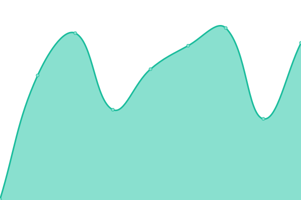

# [📈 Live Status](https://0xpanoramix.github.io/flashbots-boost-status): <!--live status--> **🟩 All systems operational**

This repository contains the open-source uptime monitor and status page for [Flashbots Eth2 Relays](https://github.com/flashbots/mev-boost/wiki#testing), powered by [Upptime](https://github.com/upptime/upptime).

With [Upptime](https://upptime.js.org), you can get your own unlimited and free uptime monitor and status page, powered entirely by a GitHub repository. We use [Issues](https://github.com/0xpanoramix/flashbots-boost-status/issues) as incident reports, [Actions](https://github.com/0xpanoramix/flashbots-boost-status/actions) as uptime monitors, and [Pages](https://0xpanoramix.github.io/flashbots-boost-status) for the status page.

<!--start: status pages-->
<!-- This summary is generated by Upptime (https://github.com/upptime/upptime) -->
<!-- Do not edit this manually, your changes will be overwritten -->
<!-- prettier-ignore -->
| URL | Status | History | Response Time | Uptime |
| --- | ------ | ------- | ------------- | ------ |
|  [Kiln](https://builder-relay-kiln.flashbots.net/eth/v1/builder/status) | 🟩 Up | [kiln.yml](https://github.com/0xpanoramix/flashbots-boost-status/commits/HEAD/history/kiln.yml) | 

 176ms
     
 | 

<a href="https://0xpanoramix.github.io/flashbots-boost-status/history/kiln">100.00%</a>
    

|  [Ropsten](https://builder-relay-ropsten.flashbots.net/eth/v1/builder/status) | 🟩 Up | [ropsten.yml](https://github.com/0xpanoramix/flashbots-boost-status/commits/HEAD/history/ropsten.yml) | 

 152ms
     
 | 

<a href="https://0xpanoramix.github.io/flashbots-boost-status/history/ropsten">100.00%</a>
    

|  [Sepolia](https://builder-relay-sepolia.flashbots.net/eth/v1/builder/status) | 🟩 Up | [sepolia.yml](https://github.com/0xpanoramix/flashbots-boost-status/commits/HEAD/history/sepolia.yml) | 

 145ms
     
 | 

<a href="https://0xpanoramix.github.io/flashbots-boost-status/history/sepolia">100.00%</a>
    

<!--end: status pages-->

[**Visit our status website →**](https://0xpanoramix.github.io/flashbots-boost-status)undefined
